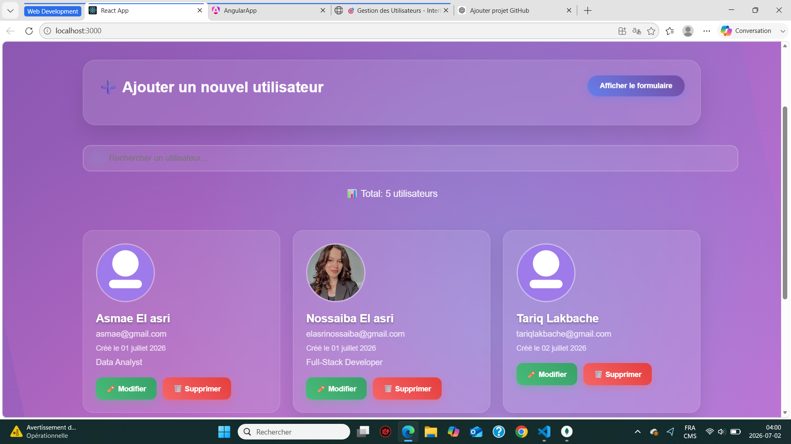
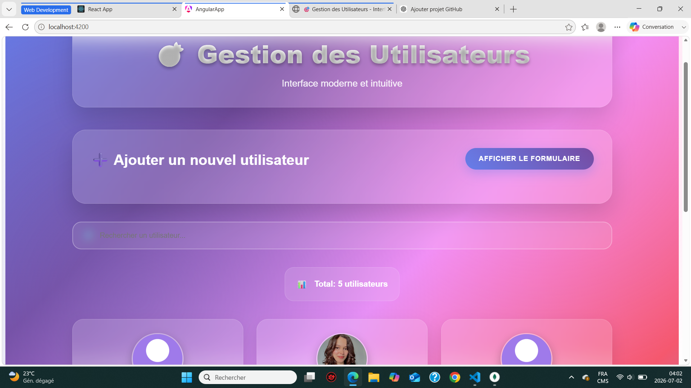
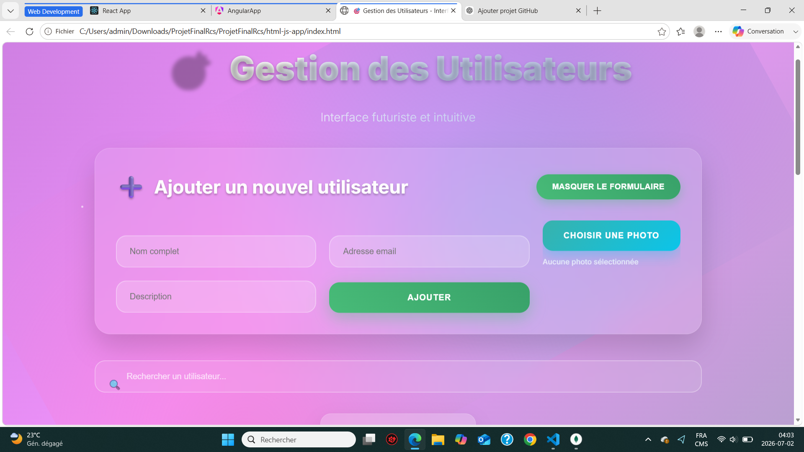
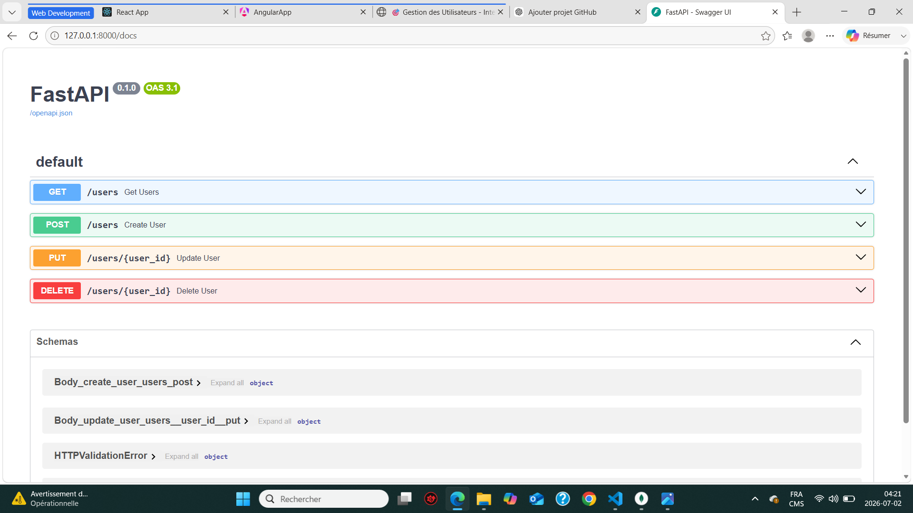
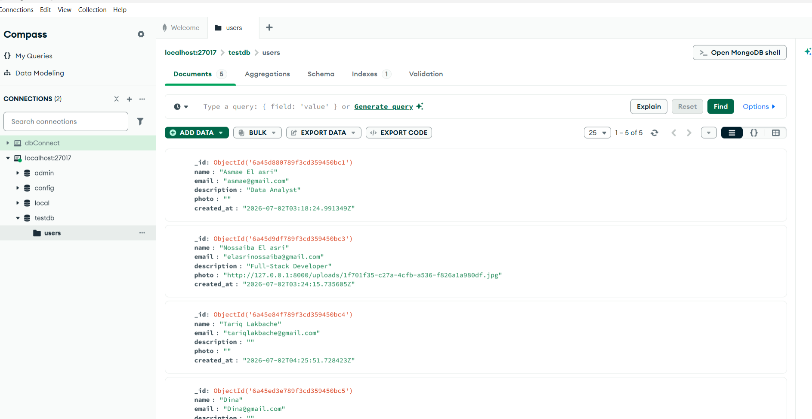
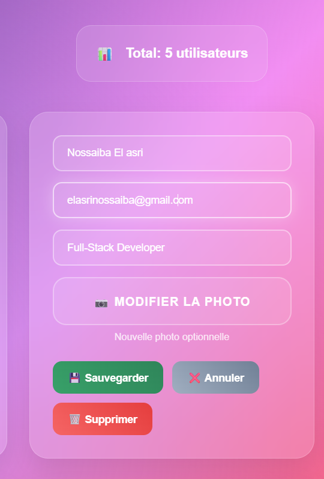

# 🎯 Gestion des Utilisateurs - Full Stack CRUD Application

A modern Full-Stack web application that allows users to manage a list of users through a complete CRUD system. The project was developed using three different front-end technologies (HTML/CSS/JavaScript, React, and Angular) connected to the same FastAPI backend and MongoDB database.

---

## 📌 Project Overview

This project demonstrates the implementation of a complete CRUD (Create, Read, Update and Delete) application using modern web development technologies.

The application allows users to:

- ➕ Create a new user
- 👀 Display all users
- ✏️ Edit user information
- 🗑️ Delete users
- 🔍 Search users instantly
- 🖼️ Upload a profile picture
- 📝 Add a personal description
- 📅 Display the creation date

All three front-end applications communicate with the same REST API developed with FastAPI and store data in MongoDB.

---

# 🏗 Project Architecture

```
                React
                  │
                Angular
                  │
          HTML / CSS / JavaScript
                  │
             REST API (FastAPI)
                  │
               MongoDB
```

---

# 🚀 Technologies Used

## Frontend

- HTML5
- CSS3
- JavaScript (ES6)
- React
- Angular

## Backend

- Python
- FastAPI
- Uvicorn

## Database

- MongoDB
- MongoDB Compass

---

# ✨ Features

✔ Create a user

✔ Read all users

✔ Update user information

✔ Delete users

✔ Search users

✔ Upload profile pictures

✔ User description

✔ Creation date

✔ Responsive modern interface

✔ REST API

✔ MongoDB integration

---

# 📂 Project Structure

```
ProjetFinalRcs
│
├── angular-app/
│
├── react-app/
│
├── html-js-app/
│
├── uploads/
│
├── main.py
│
├── screenshots/
│
├── README.md
│
└── requirements.txt


---

# ⚙ Installation

## Clone the repository

```bash
git clone https://github.com/yourusername/ProjetFinalRcs.git
```

```
cd ProjetFinalRcs
```

---

## Install Python dependencies

```bash
pip install -r requirements.txt
```

---

## Start FastAPI

```bash
uvicorn main:app --reload
```

Backend available at:

```
http://127.0.0.1:8000
```

Swagger documentation:

```
http://127.0.0.1:8000/docs
```

---

## React

```bash
cd react-app
npm install
npm start
```

---

## Angular

```bash
cd angular-app
npm install
ng serve
```

---

## HTML / JavaScript

Simply open:

```
html-js-app/index.html
```

or use Live Server in VS Code.

---

# 📷 Screenshots

## React Application



---

## Angular Application



---

## HTML / CSS / JavaScript



---

## FastAPI Swagger



---

## MongoDB Compass



---
## Edit User



# 🔌 API Endpoints

| Method | Endpoint | Description |
|---------|----------|-------------|
| GET | /users | Get all users |
| POST | /users | Create user |
| PUT | /users/{id} | Update user |
| DELETE | /users/{id} | Delete user |

---
# 🔌 API Endpoints

| Method | Endpoint | Description |
|---------|----------|-------------|
| GET | /users | Get all users |
| POST | /users | Create user |
| PUT | /users/{id} | Update user |
| DELETE | /users/{id} | Delete user |

---

## 📚 What I Learned

- Building REST APIs with FastAPI
- Working with MongoDB
- Implementing CRUD operations
- Developing applications using React
- Developing applications using Angular
- Connecting multiple frontends to a single backend
- Handling image uploads
- Improving responsive user interfaces

---
# 📈 Future Improvements

- Authentication (JWT)
- User roles
- Pagination
- Image compression
- Email validation
- Cloud image storage
- Docker deployment

---

# 👩‍💻 Author

**Nossaiba El Asri**

Full-Stack Web Developer

Montreal, Canada

LinkedIn:
https://ca.linkedin.com/in/nossaiba-el-asri-69114b217

GitHub:
https://github.com/nossaiba-elas

---

# 📄 License

This project was developed for educational purposes.